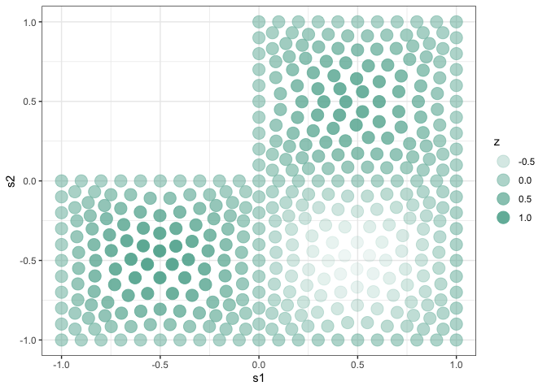
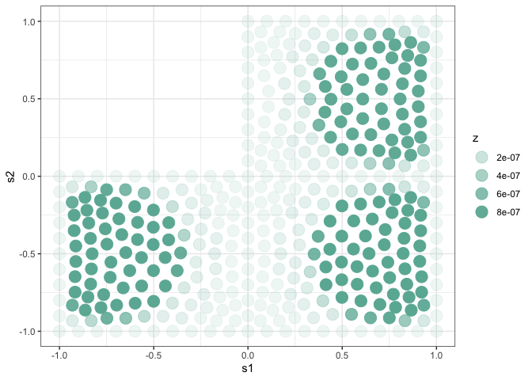

mcGP package
================
Chih-Li Sung
November 10, 2023

This R package allows the emulation using a mesh-clustered Gaussian
process (mcGP) model for partial differential equation (PDE) systems.
More details can be seen in [Sung, Wang, Ding, and Wang
(2023)](https://arxiv.org/abs/2301.10387).

You can install the package using `install_github` function as follows:

``` r
library(devtools)
install_github("ChihLi/mcGP")
```

A few examples are given below. This is a PDE system on an L-shaped
membrane based on Poisson’s equation. The data is provided in this
package, which can be loaded by `data(poisson_dat)`. More details about
the dataset can be found by `help(poisson_dat)`.

### load data

We see that `X` is the input data which is one dimensional and has five
observations. `S` is the mesh specification, which is two dimensional
and has 401 mesh nodes. `Y` is the multiple outputs on the 401 mesh
nodes, so it has five columns (i.e., sample size of `X`) and has 401
rows.

``` r
library(mcGP)

# example: Poisson equation simulations 
# (data was generated by finite element methods via MATLAB)

data(poisson_dat)   
attach(poisson_dat)
print(dim(X)) # input: sample size is 5; one input variable
```

    ## [1] 5 1

``` r
print(dim(S)) # mesh node coordinates: 2-dimensional mesh; 401 mesh nodes
```

    ## [1] 401   2

``` r
print(dim(Y)) # outputs at these mesh nodes: sample size is 5; 401 outputs at mesh nodes
```

    ## [1] 401   5

### Visualize two training examples

Plot the output data of $x=-0.8$ and $x=0.8$.

``` r
# visualize two training examples
library(ggplot2)
pde.plot <- function(u, nodes, ...){
  df <- data.frame(S, u)
  colnames(df) <- c("s1", "s2", "z")
  ggplot(df, aes(x=s1, y=s2, alpha=z)) + 
    geom_point(color="#69b3a2",size=5) + theme_bw()
}

pde.plot(Y[,1], S) # when x=-0.8
```


``` r
pde.plot(Y[,5], S) # when x=0.8
```


### Model fitting

Perform model fitting by `mcGP` function.

``` r
# model fitting
set.seed(123) # for reproducibility
fit <- mcGP(X,Y,S)
```

### Prediction

Perform predictions by `predict.mcGP` function. We make predictions on
the test dataset `X.test`, which is $x=-0.25$.

``` r
# making predictions
pred <- predict(fit, Y, xnew = X.test)
```

### Visualize the variational distribution

Visualize the variational distribution $q(Z)$.

``` r
# qZ
pde.plot(fit$q_Z[,1], S)
```


``` r
pde.plot(fit$q_Z[,2], S)
```


``` r
pde.plot(fit$q_Z[,4], S)
```


``` r
pde.plot(fit$q_Z[,5], S)
```


``` r
pde.plot(fit$q_Z[,6], S)
```


``` r
pde.plot(fit$q_Z[,7], S)
```


### Visualize predictions

``` r
# prediction mean
pde.plot(pred$mean, S)
```



``` r
# prediction variance
pde.plot(pred$sig2, S)
```



### Parallel computing

Parallel computing can be done by `parallel=TRUE`. You could specify the
number of cores by the argument `n.cores`. More details can be found by
`help(mcGP)`.

``` r
#model fitting (with parallel computing)
fit2 <- mcGP(X,Y,S, parallel=TRUE)
```

``` r
print(fit$time.elapsed)  # without parallel computing
```

    ##    user  system elapsed 
    ##   9.506   0.052   9.638

``` r
print(fit2$time.elapsed) # with parallel computing
```

    ##    user  system elapsed 
    ##   7.946   0.075  10.137
